class: center, middle

# Practical Deep Learning


### <a href="http://micha.codes/">micha.codes</a> / <a href="http://fastforwardlabs.com/">fastforwardlabs.com</a>

???

---

class: center, middle

# deep learning can seem *mysterious*


???

Deep learning has been quite a hot topic lately, mainly fueled by it's almost
unbelievable results

---

class: center, middle

# let's find a way to just build a function

???

- let's go backwards through history and just start with building a function
- I think of ML as mainly data cleaning and finding a function (mathematical or
  otherwise) that describes the data

---

class: center, middle

## Feed Forward Layer 

```
# X.shape == (512,)
# output.shape == (4,)
# weights.shape == (512, 4) == 2048
# biases.shape == (4,)
def feed_forward(activation, X, weights, biases):
    return activation(X @ weights + biases)
```

IE: $ f(X) = \sigma \left( X \times W + b \right) $

???

- Also called a fully-connected or a dense layer
- This looks a lot like linear regression if we remove the `activation` function
- Or maybe it looks a lot like logistic regression if we had a `softmax` function
    - note: `softmax` == multidim logit

---

class: center, middle

# What's so special?

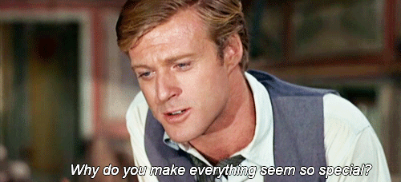

---

class: center, middle

# Composable

```
# Just like a Logistic Regression

result = feed_forward(
    softmax,
    X,
    outer_weights,
    outer_biases
)
```

???

- This is where the deep in deep learning comes from!

---

class: center, middle

# Composable

```
# Just like a Logistic Regression with learned features?

result = feed_forward(
    softmax,
    feed_forward(
        tanh,
        X,
        inner_weights,
        inner_biases
    )
    outer_weights,
    outer_biases
)
```


???

- This is where the deep in deep learning comes from!

---

class: center, middle

# nonlinear


---

class: center, middle

# UNIVERSAL APPROXIMATION THEOREM

### neural networks can approximate arbitrary functions

???

- this basically says that NN's can be

---

class: center, middle

# differentiable ➡️️ SGD

### Iteratively learn the values for the weights and biases given training data

???

- "brute force"
- Automatic differentiation means we can compute the important dWeights/dX in
  order to do backpropogation
- IE: Given example input/output, how can we iteratively tune the weights and
  biases to get the best results

---

class: center, middle, full-bleed

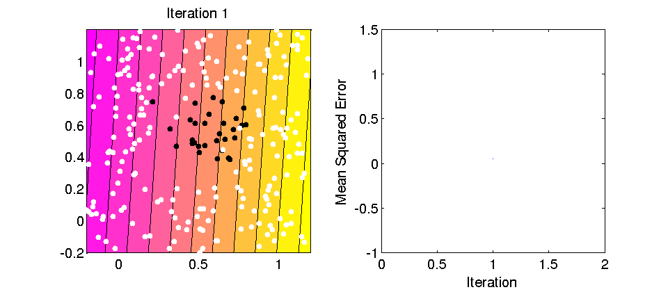

???

- Instead of apriori setting the weights, just specify training data and a way
  of comparing the data labels with the model results (ie: loss function)

---

class: center, middle, full-bleed


???

- There are many variations, but they all do the same thing (but which one is
  best depends on the problem and the model)
- There are even mechanisms to learn a custom algorithm for your problem! (ie:
  learning to learn SGD by SGD)

---

class: center, middle, full-bleed


---

class: center, middle

## Convolutional Layer

```
import numpy as np
from scipy.signal import convolve

# X.shape == (800, 600, 3)
# filters.shape == (8, 8, 3, 16)
# biases.shape == (3, 16)
# output.shape < (792, 592, 16)
def convnet(activation, X, filters, biases):
    return activation(
        np.stack([convolve(X, f)
                  for f in filter])
        + biases
    )
```

IE: $ f(X) = \sigma \left( X \ast f + b \right) $

???

More complicated layers that you may have heard also are just as simple as our
feed forward example!

---

class: center, middle, full-bleed


---

class: center, middle

## Recurrent Layer

```
# X_sequence.shape == (None, 512)
# output.shape == (None, 4)
# W.shape == (512, 4)
# U.shape == (4, 4)
# biases.shape == (4,)
def RNN(activation, X_sequence, W, U, biases, activation):
    output = None
    for X in X_sequence:
        output = activation(x @ W + output @ U + biases)
        yield output
```

IE: `$ f_t(X_t) = \sigma \left( X_t \times W + f_{t - 1}( X_{t - 1} ) \times U + b \right) $`

---

class: center, middle

## GRU Layer

```
def GRU(activation_in, activation_out, X_sequence,
        W, U, biases):
    output = None
    for X in X_sequence:
        z = activation_in(W[0] @ X +
                          U[0] @ output +
                          biases[0])
        r = activation_in(W[1] @ X +
                          U[1] @ output +
                          biases[1])
        o = activation_out(W[2] @ x +
                           U[2] @ (r @ output) +
                           biases[2])

        output = z * output + (1 - z) * o
        yield output
```

???

Even recurrent layers are _relatively_ straight forward

---

class: center, middle

# What about theano/tensorflow/mxnet?

---

class: center, middle, full-bleed


???

euclid's GCD algorithm

---

class: center, middle

library    | widely used | auto-diff | gpu/cpu | mobile | frontend | models | multi-gpu | speed
---------- | ----------- | --------- | ------- | ------ | -------- | ------ | --------- | -----
numpy      |     ✔️️       |     ✖️️     |   ✖️️     |   ✖️️    |    ✖️️     |   ✖️️    |    ✖️️      | slow
theano     |     ✔️️       |     ✔️️     |   ✔️️     |   ✖️️    |    ✖️️     |   ✖️️    |    ✖️️      | fast
mx-net     |     ✖️️       |     ✔️️     |   ✔️️     |   ✔️️    |    ✔️️     |   ✔️️    |    ✔️️      | fast
tensorflow |     ✔️️       |     ✔️️     |   ✔️️     |   ✖️️    |    ✔️️     |   ✔️️    |    ➖     | slow

???

- Theano: Like writing assembly code... not much high level API to help you out
  but your code is quick!
- Tensorflow: Trying to straddle the line between assembly and python... low
  level backend is accessible but it also comes with many high level functions
  already implemented (like most classic layers already implemented, nice UI, etc) 
- MX-Net: like tensorflow but with more of an emphasis on the high level
  functions and on portablility/hardware/speed.

---

class: center, middle

# Which should I use?

---

class: center, middle


## keras makes Deep Learning simple
### (http://keras.io/)

---

class: middle, center

```bash
$ cat ~/.keras/keras.json
{
    "image_dim_ordering": "th",
    "epsilon": 1e-07,
    "floatx": "float32",
    "backend": "theano"
}
```

#### or

```bash
$ cat ~/.keras/keras.json
{
    "image_dim_ordering": "tf",
    "epsilon": 1e-07,
    "floatx": "float32",
    "backend": "tensorflow"
}
```

???

- There are caveats to this
    - Image ordering is different in theano/tensofrlow
    - Tensorflow you have to unroll RNNs
- Abstracts the backend of choice into a unified api so you can still write raw
  code, but you do it through keras

---

class: middle, center

(coming [soon](https://github.com/dmlc/mxnet/issues/4173)...
[hopefully](https://github.com/shivarajugowda/keras/commits/master))
```bash
$ cat ~/.keras/keras.json
{
    "image_dim_ordering": "mx",
    "epsilon": 1e-07,
    "floatx": "float32",
    "backend": "mxnet"
}
```

---

class: middle, center

# simple!

```
from keras.models import Sequential
from keras.layers.core import Dense

# Same as our Logistic Regression above with:
#     weights_outer.shape = (512, 4)
#     biases_outer.shape = (4,)
model_lr = Sequential()
model_lr.add(Dense(4, activation='softmax', input_shape=[512]))
model_lr.compile('sgd', 'categorical_crossentropy')
model_lr.fit(X, y)
```

---

class: middle, center

# extendible!

```
from keras.models import Sequential
from keras.layers.core import Dense

# Same as our "deep" Logistic Regression
model = Sequential()
model.add(Dense(128, activation='tanh', input_shape=[512]))
model.add(Dense(4, activation='softmax'))
model.compile('sgd', 'categorical_crossentropy')
model.fit(X, y)
```

---

class: center, middle
```
model_lr.summary()
# __________________________________________________________________________
# Layer (type)              Output Shape    Param #     Connected to
# ==========================================================================
# dense_1 (Dense)           (None, 4)       2052        dense_input_1[0][0]
# ==========================================================================
# Total params: 2,052
# Trainable params: 2,052
# Non-trainable params: 0
# __________________________________________________________________________

model.summary()
# ___________________________________________________________________
# Layer (type)       Output Shape    Param #     Connected to
# ===================================================================
# dense_2 (Dense)    (None, 128)     65664       dense_input_2[0][0]
# ___________________________________________________________________
# dense_3 (Dense)    (None, 4)       516         dense_2[0][0]
# ===================================================================
# Total params: 66,180
# Trainable params: 66,180
# Non-trainable params: 0
# ___________________________________________________________________
```

---

class: center, middle

# let's build something

???

So...

 - Summarization is intrinsically important

 - We built three working examples: one is extremely simple and demonstrates
   the steps at a high level, one uses a ~10 year old innovation called topic
   modelling, and one uses a couple of ~2 year old innovations called recurrent
   neural networks and language embeddings)

 - Step 1 of any good summarization algorithm is also step 1 of any other
   algorithm dealing with language, so these breakthroughs are important even
   if you don't have a need for summarization. It's fundamental to working with
   human language on computers.

---

class: center, middle


???

First let's talk about why it's an intrinsically important task.

Wouldn't it be cool be able to extract the most salient points from a long
document? 

---

class: center, full-bleed


???

Our main prototype does this. You're reading a long article on the
New Yorker and you hit the "Brief" button, and you get the same article, but
with the 5 top sentences highlighted.

---

class: center, middle


???

This is our report. I'm going to give take you through the most important
points now. But I want to begin by saying _why now_.

1. More urgent than ever (more documents being generated)
2. Unstructured or semi-structured data is commonly collected, and training
   data is available.
3. Algorithmic advances, most importantly in neural networks
4. CPU and GPU power for using these algorithmic approaches is affordable and
   accessible.
5. Open source libraries

---

class: center, middle


### [fastforwardlabs.com/luhn/](http://fastforwardlabs.com/luhn/)

???

This story starts in the 1950's with *Hans Peter Luhn* with his heuristics based
summarization algorithm

---
class: center, middle, full-bleed
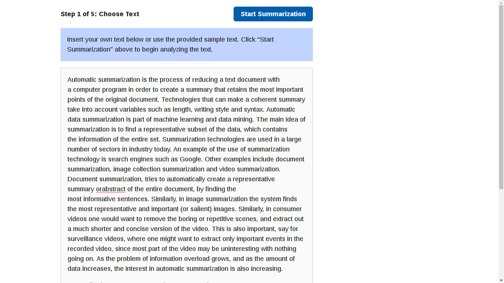
???
As with any summarization algorithm it starts with an input of text.  For this
example, we'll use the first couple paragraphs of wikipedia's article on text
summarization
---
class: center, middle, full-bleed
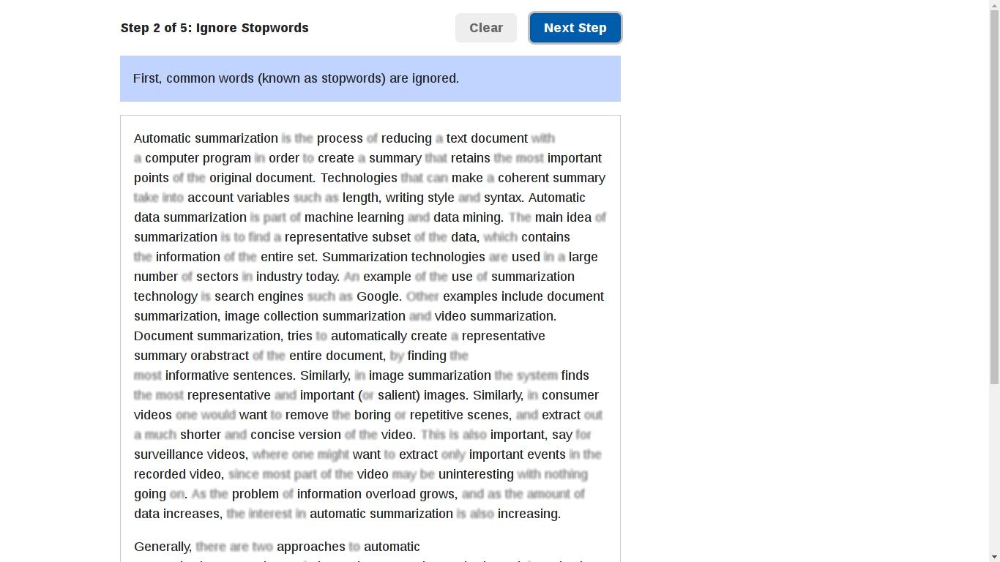
???
The first step, which is a common one in all of NLP, is to filter out stop
words.  Stop words are words like "the" and "and" which don't intrinsically have
much meaning other than in context.
---
class: center, middle, full-bleed
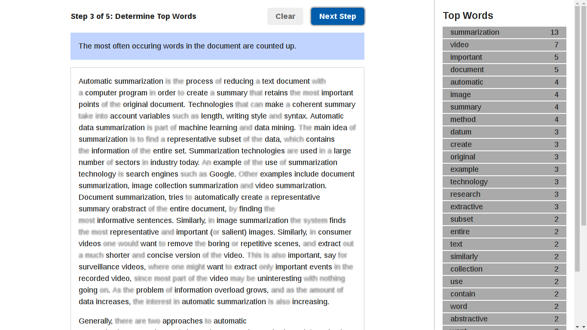
???
Now we count up the occurences of all the words that are left.  The assumption
here is that words that are used a lot are important!  For example, if we are
talking about summarization, we will use the word "summarization" quite heavily.
---
class: center, middle, full-bleed
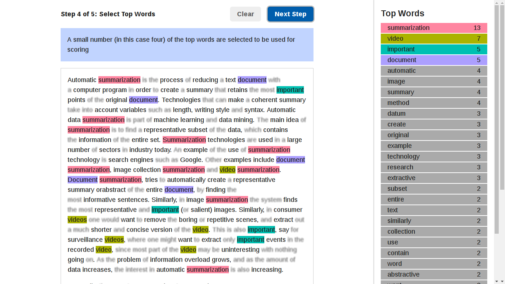
???
The top words in this list are selected and we find them in the document.
Sentences with a higher number of these words get a higher score
---
class: center, middle, full-bleed
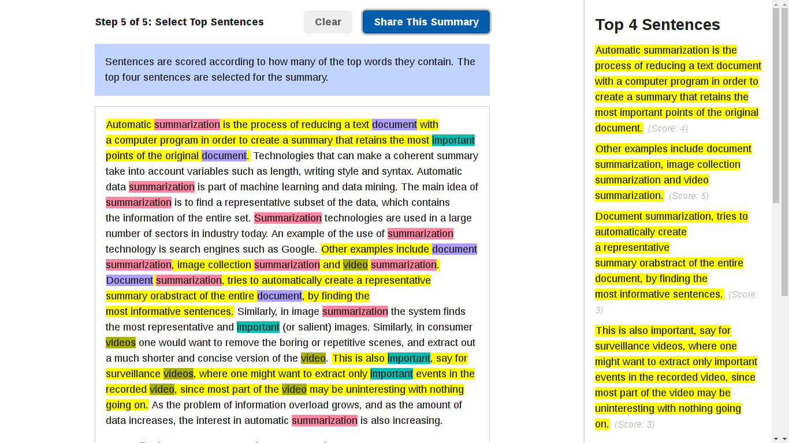
???
finally, we select sentences with the highest score and arrange them in some way
to the user as the summary.  Sometimes it is best to show a list of sentences
ordered by their score, other times it is better to pick the N top sentences and
order them by where they occurred in the original article.

Luhn's method is great but it doesn't utilize any prior knowledge about language
other than the existence stop words.  There are comparable methods that are
essentially Luhn with the understanding of synonyms and modified weights for
specifics words, but these are just band aids.

---

class: center, middle


???

Looking at the algorithm though, we can split it apart into distinct phases
which seem to follow us regardless of which specific summarization algorithm we
are talking about.

First you **vectorize**, which means turn each sentence in the text **into
numbers**.  Machines only speak numbers. You want to do this in a way that
preserves and makes accessible to the computer as much of the meaning as
possible.

Second the algorithm **scores** each sentence. This is done by analyzing the
vectorized version of each sentence. How you get from vector to score depends
on the vector, but the point is you're going to boil down a lot of numbers into
one number, and the bigger the number, the better the sentence.

Finally you **select** a subset of high scoring sentences. You might simply
choose to the top 5. Or you might do something more sophisticated like replace
pronouns with their referents, or penalize similar sentences. 

The first step is the most important. Doing a good job here lays the foundation
that the rest of the algorithm builds on. And doing a good job here also lays
foundations for other language tasks (simplification, translation, audio to
text, image to caption, semantic search, etc.) And it's innovations in this
step that lead us to write this report now. 

---

class: center, middle


???

And it's with this that we can see the biggest problem with Luhn's method... the
only understanding we have of the language is coming from the bag of words
approach in the vectorization step!

This kind of works. It throws away word order (see "dog bites man" and "man
bites dog"), negation ("not good" is split into two words). But let's see how
far we can get using this as the vectorize step.

[Luhn demo](http://www.fastforwardlabs.com/luhn/)

---

class: center, middle, full-bleed


???

Luhn's method (and heuristics like it), are very simple. And they work OK in
jargon-heavy documents. But they look only for common words. Not common
_topics_.

This is where the recent innovations can come in to help -- we have recently
leveled up in our ability to understand language through various types of
language models.  These language models either use assumptions about how text is
created or training data in order to form a strong prior about how language is
composed and what the meaning of the resting text is.

---

class: center, middle, full-bleed


???

So we've got two things we want to fix with our approaches to vectorization so
far: retain more meaning for each word or sentence, and retain information
about word or sentence order.

Exciting breakthroughs on both these problems happened in the last couple of
years. In the case of retaining more meaning it's language embeddings like
word2vec. And in the case of using order, it's recurrent neural networks. Both
of these came out of the deep learning community.

Let's look at language embeddings. This is a way of taking a collosal corpus of
text (say all the books that have ever been digitized) and using this to learn
what words are likely to precede and follow a word. 

---

class: center, middle, split-50

.column[  ]
.column[  ]

???

This part of the story is hard to pin down on specific people since there are so
many contributions that are still happening... but I'd like to attribute some of
the more important steps for our purposes to *Tomas Mikolov* and *Jamie Ryan
Kiros*

---

class: center, middle


```
def skipgram(words):
    for i in range(1, len(words)-1):
        yield words[i], (words[i-1], words[i+1])
```

???

Word2vec came out a in 2013 uses skipgrams to train a neural network to
"learn" how a language works.  This reduces down to taking a normal word
vectorization in a high dimensional space and training a neural network to be
able to predict the context of that word in examples of real language.


Internally, the neural network is using a representation of the word that has a
smaller dimensionality than the original vectorization.  By doing this and also
training on counter-examples, the algorithm effectively clusters words in a
lower dimensional space (normally on the order of hundreds of dimensions) where
similar words by _symantics_ are close to each other.

---

class: center, middle

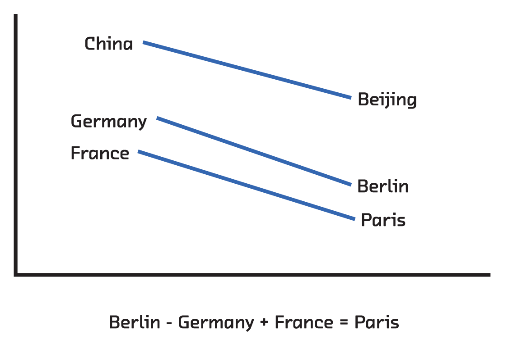


???

When doing this you effectively get a dense representation of words in a
small-ish dimensional space (ie: a vector, like bag of words, but every entry
has a value). These numbers are like coordinates. And words that have
coordinates close to each other are semantically related, and the directions and
distances between these coordinates turn out to be semantically significant too.
This is an example: the way you get from "China" to "Beijing" is the same way
you get from "Germany" to "Berlin".

This is all kind of vague, but it turns out that coordinates with these
properties are essentially encoding the _meaning_ of words into numbers that
computers can work with. This is a huge deal!

---

class: center, middle

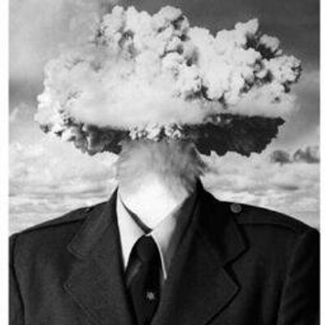

???

Let's sit back and think about how crazy that is.  When I first described this
algorithm all I was talking about was predicting the context of words.  But in
the end, the algorithm is able to do things like analogies with simple
mathematical operations.

This points to this representation of a word as encoding actual semantics in an
easily accessible form. All this just by having the algorithm read through
pre-written text and without any supervision in the classic sense.

---

class: center, middle

```
from keras.models import Model
from keras.layers import (Input, Embedding, Merge,
                          Lambda, Activation)

vector_size=300
word_index = Input(shape=1)
word_point = Input(shape=1)

syn0 = Embedding(len(vocab), vector_size)(word_index)
syn1= Embedding(len(vocab), vector_size)(word_point)

merge = Merge([syn0, syn1], mode='mul')
merge_sum = Lambda(lambda x: x.sum(axis=-1))(merge)
context = Activation('sigmoid')(merge_sum)

model = Model(input=[word, context], output=output)
model.compile(loss='binary_crossentropy', optimizer='adam')
```

---

class: center, middle, split-50

## Feed Forward vs Recurrent Network

.column[
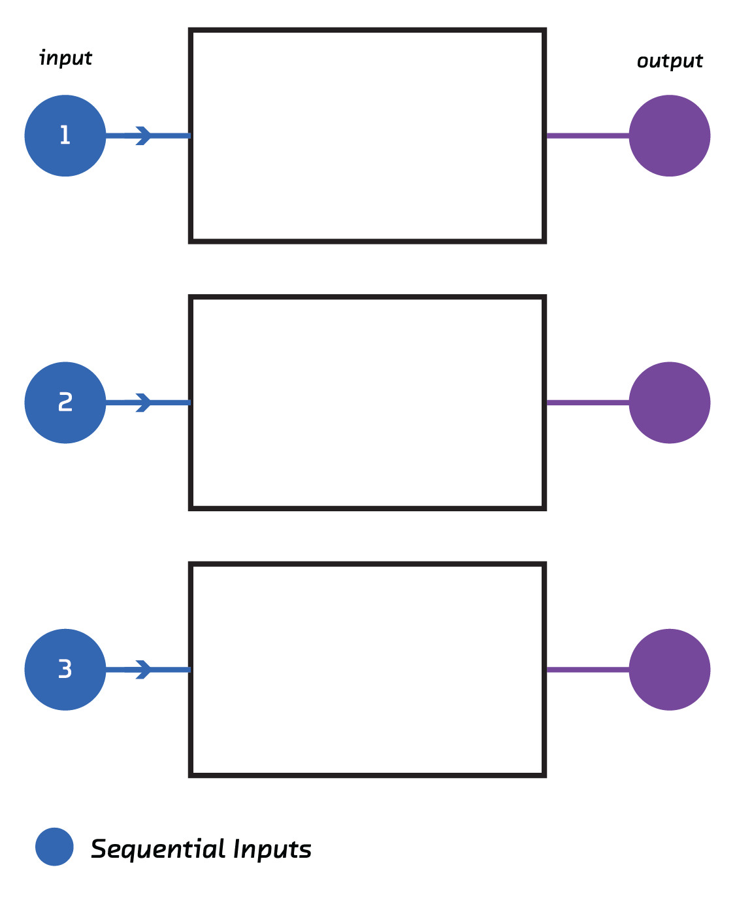
]
.column[

]

???

So that's retaining word meaning. What about order? Arguments are built up.
Hypotheticals explored. The first and last sentences carry special signficance.
All this, which helps a human write a summary, is thrown away if you don't
retain order.

Traditional machine learning struggles here because of a simple almost mundane
reason: documents (i.e. the input) are of different lengths. Bag of words and
topic modelling are ways around this, but they all throw away order information
to squeeze every document into the same size vector.

But a couple of years ago, researchers figured out how to chain together neural
networks (and crucially, how to train these chains). This allows input or
output of arbitrary size to be fed in or out as a sequence with order. These
are recurrent neural networks.

---

class: center, middle


???

With this we have the ability to continue past words and to start creating these
smart vectorizations for sentences.  We can play the same game that we played in
word2vec by predicting the sentences that come before and after.  This, however,
requires A LOT more data.  Our favorite sentence-level embedding is called
`skip-thoughts` and it uses the MovieBook and BookCorpus.  This training set has
11,038 books and 11 movie/book pairs.  

In the end, this gives you the ability to encode a _sentence_ into a vector with
4800 dimensions that captures the sentences meaning.  And just like word2vec was
able to solve tasks that it wasn't originally meant to, skipthoughts can solve
problems like sentence relatedness and paraphrase detection without ever being
told how to.

This relatedness problem is actually a pretty important property for
summarization.  In many texts, arguments are built up until we get to a
conclusion and then a new argument is created.  By being able to quantify how
related two sentences are, we are able to identify these arguments and hopefully
figure out the punchline.

---

class: middle, split-60

## RNN Summarization Sketch for Articles

.column[
1. Find articles summaries heavy on quotes (http://thebrowser.com/)
2. Score every sentence in the articles based on their "closeness" to a quote
3. Use `skip-thoughts` to encode every sentence in the article
4. Train and RNN to predict these scores given the sentence vector
5. Evaluate trained model on new things!
]

.column[

]

???

- thebrowser has many longform article which can be tough since the sentence
scores form a long tail distribution
- for our sentence score, we find the minimum jaccard distance between a
sentence in the article to all quotes from the summary.
- this gives us a quantitative measure to score our model -- how well do we
reproduce the scores?

---

class: center, middle


## keras makes RNN's simple
### (http://keras.io/)

---

class: left, middle

## Example: proprocess

```
from skipthoughts import skipthoughts

from .utils import load_data

(articles, scores), (articles_test, scores_test) = load_data()
articles_vectors = skipthoughts.encode(articles)
articles_vectors_test = skipthoughts.encode(articles_test)
```

---

class: left, middle

## Example: model def and training

```
from keras.models import Model
from keras.layers.recurrent import LSTM
from keras.layers.core import Dense
from keras.layers.wrappers import TimeDistributed

model = Model()
model.add(LSTM(512, input_shape=(None, 4800),
               dropout_W=0.3, dropout_U=0.3))
model.add(TimeDistributed(Dense(1)))
model.compile(loss='mean_absolute_error', optimizer='rmsprop')

model.fit(articles_vectors, scores, validation_split=0.10)
loss, acc = model.evaluate(articles_vectors_test, scores_test)
print('Test loss / test accuracy = {:.4f} / {:.4f}'
      .format(loss, acc))

model.save("models/new_model.h5")
```

???

- Neural models are all easily composable
- Regularization is important to make sure you don't overfit when you have MANY parameters
- Note the subtlety to using LSTM here as opposed to normal feed forward
- Here we use an LSTM so the 'score' for one sentence depends on all the previous sentences

---

class: center, middle, full-bleed

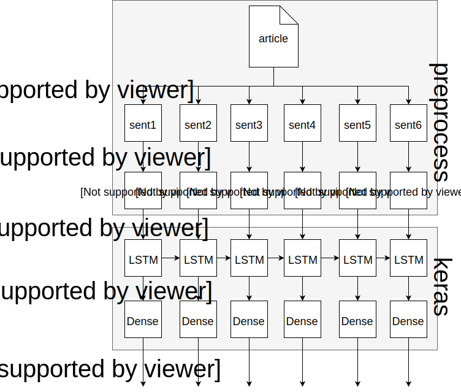

???

- all the dense networks share the same weights... that's why it's called
  timedistributed
- give dropout story

---

class: left, middle

## Example Model: evaluation

```
from keras.models import load_model
from flask import Flask, request
import nltk

app = Flask(__name__)
model = load_model("models/new_model.h5")

@app.route('/api/evaluate', methods=['POST'])
def evaluate():
    article = request.data
    sentences = nltk.sent_tokenize(article)
    sentence_vectors = skipthoughts.encode(sentences)
    return model.predict(sentence_vectors)
```

---

class: center, full-bleed


???

We use these to techniques, language embeddings and recurrent neural networks
in our summarization prototype, Brief, which is a browswer extension.

Brief is trained on example summaries from a longread aggregator called The
Browser. It uses word embeddings and knows how to identify salient sentences in
the context of the other sentences in a document.

---

class: center, full-bleed


???

[http://www.fastforwardlabs.com/brief/](http://www.fastforwardlabs.com/brief/)

Or demo the working prototype

---

class: center, middle

## Thoughts of doing this method

.left[
- Scoring function used is SUPER important
- Hope you have a GPU
- Hyper-parameters for all!
- Structure of model can change where it's applicable
- SGD means random initialization... may need to fit multiple times
]

???

- We picked jaccard but maybe we should have used skipthoughts? using jaccard
introduces problems like luhn of synonyms (although using quotes mitigates this)
- GPU's make training happen in ~6 hours with our 18,000 articles
- structure of model and hyper-parameters can change a lot... 
    - articles are good with RNN's, fiction is better with a feed forward
    - training window of data changes how long of an argument it looks for, etc

---

class: center, middle, full-bleed


---

class: middle, center

# REGULARIZE!

.left[
- **dropout**: only parts of the NN participate in every round
- **l1/l2**: add penalty term for large weights
- **batchnormalization**: unit mean/std for each batch of data
]

---

class: middle, center

# VALIDATE AND TEST!

### lots of parameters <br>== <br>potential for overfitting
---

class: middle, center

# deploy?


---

class: middle, center


???

- GPU required
    - expensive to get, non-trivial to configure
    - makes dockerized deploys hard
- Memory-limited (especially gpu memory)
- Serial evaluation 
- LARGE model files
    - trained models can easily be several GB

---

class: center, middle, full-bleed

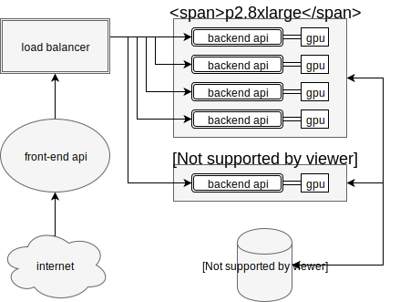

---

class: center, middle

# careful: data drift

#### set monitoring on the distribution of results

---

class: center, middle


???

We talked about three approaches. The first, Luhn's method, which is a
heuristic method, is really explanatory toy. It goes through the same
fundamental steps as the others, but it's not a production approach. That said,
it requires no training data at all, it's computationally extremely cheap, and
the results are interpretable (which is useful when things go wrong).

LDA requires a training corpus, but no model summaries. It's computationally
more expensive, but not a significant engineering challenge. And the results
generally make sense. In fact, the topics can be used for lots of other things
including document clustering and bootstrapping article recommendation.

The language embedding/RNN approach is, for now, the gold standard of
extractive summarization. You need model summaries and computational resources.
Despite this, this is the approach we're most excited about.

---

class: center, middle, full-bleed


???

That's because it's an approach that can be used any time a computer needs to
work with the _meaning_ of language. By retaining meaning and order, recurrent
networks are being used to make breakthroughs in language tasks like
translation, simplification, caption creation, search and speech recognition
every day.

---

class: center, middle


???

And the good news is, while neural networks have a tough reputation, the
libraries are starting to reach the point where non-specialist engineers can
work with them, and connect together (compose) neural networks like lego, for
all kinds of input and output.

We're really excited about this stuff!

---

class: middle, split-50

# Emerging Applications

.column[
- Text Generation
- Audio Generation
- Event Detection
- Intent Identification
- Decision Making
]

.column[

]

???

NOTE: What goes here should be tuned for each person we present to. These are just examples.

---

class: center, middle


<marquee></marquee>
???

Thank you!
